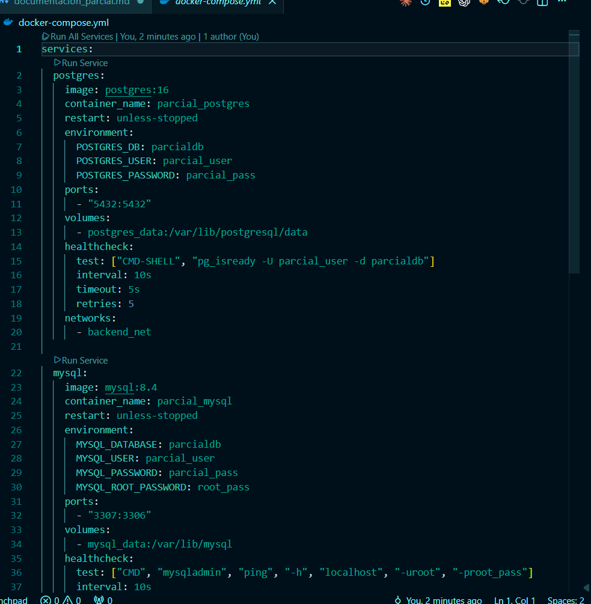
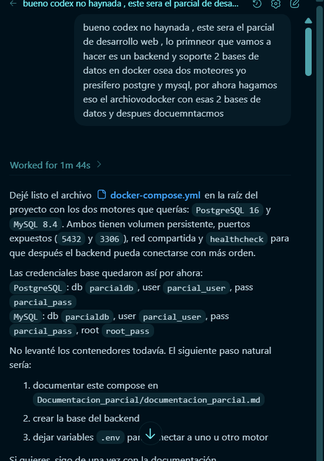
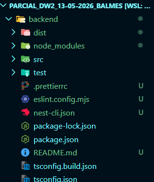
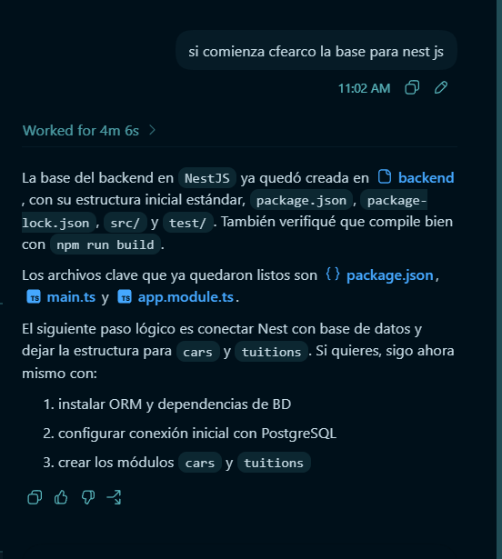
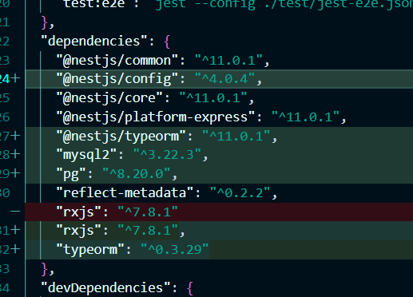
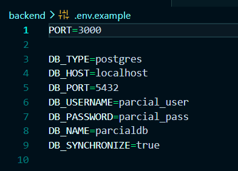
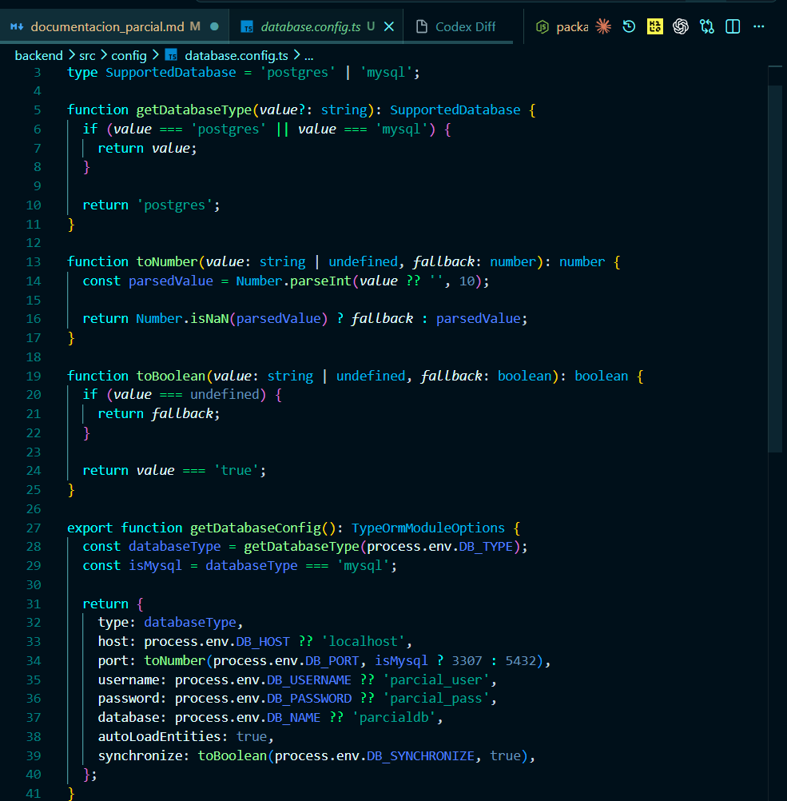
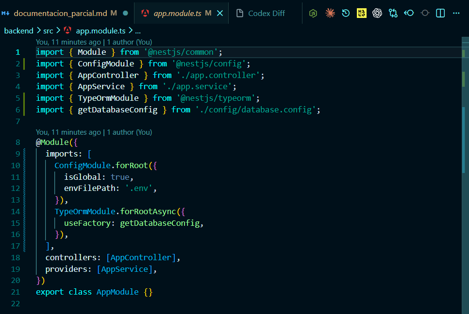
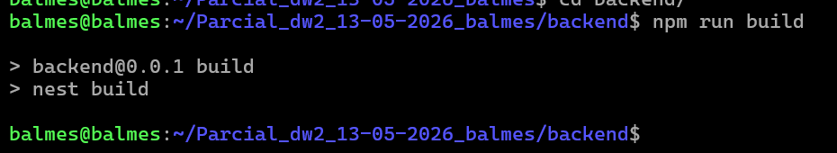

# Parcial Desarrollo Web 2

Este proyecto consiste en construir un backend con soporte para `PostgreSQL` y `MySQL` usando Docker.

La arquitectura del backend se desarrollara con `NestJS`.

Se trabajara con dos tablas:

- `cars`: `id`, `marca`, `clase`, `modelo`, `cilindraje`, `capacidad`
- `tuitions`: `id`, `date_matricula`, `ciudad`, `pago`, `car_id`

La relacion es `1 a N`: un carro puede tener muchas matriculas y cada matricula pertenece a un solo carro.

El proyecto incluira:

- modelos con validacion
- controladores y rutas
- creacion fisica de tablas
- 20 registros por tabla con Faker
- pruebas HTTP para el CRUD
- verificacion en DBeaver

Las imagenes de evidencias se guardaran en `Documentacion_parcial/imagenes`, separadas por subcarpetas segun el tema documentado, por ejemplo `docker`, `dbeaver` o `http`.

1: Para empezar vamos a crear un archivo docker que creara los moteres de las bases de datos que yo elegi en este caso `PostgreSQL` y `MySQL` 

Evidencia inicial de Docker:

Con este promt empece la creacion del archi docker:

2: Una vez ya tengo el archivo docker comenzare a contruir el Backend con la estructura inicial. voy a hacer el Backend es este caso con `NestJS`.

Asi inicio el backend depues de la intlacion:

El promt que ultilice para centar las bases de nest:

3: Despues de tener la base del backend creada, se configuro el ORM para que el proyecto pueda trabajar con `PostgreSQL` o `MySQL` segun la configuracion definida en el archivo `.env`.

En este paso se instalaron las dependencias necesarias de `TypeORM`, `@nestjs/config`, `pg` y `mysql2`, las cuales permiten manejar el ORM, leer variables de entorno y conectarse a los dos motores de base de datos definidos para el proyecto.

En la siguiente imagen se observan las dependencias agregadas en el archivo `package.json`, evidenciando que el backend ya fue preparado para trabajar con un ORM y con ambos drivers de conexion.

Tambien se creo una configuracion central para la base de datos, permitiendo cambiar valores como:

- `DB_TYPE`
- `DB_HOST`
- `DB_PORT`
- `DB_USERNAME`
- `DB_PASSWORD`
- `DB_NAME`
- `DB_SYNCHRONIZE`

En la siguiente evidencia se muestra el archivo `.env.example`, encargado de definir de forma configurable el tipo de base de datos, el host, el puerto, el usuario, la contrasena y el nombre de la base de datos que utilizara el backend.

En la siguiente imagen se observa el archivo `src/config/database.config.ts`, encargado de centralizar la logica de conexion y de interpretar las variables del `.env` para decidir si el backend trabajara con `PostgreSQL` o con `MySQL`.

En esta evidencia se muestra el archivo `src/app.module.ts`, donde se integra `ConfigModule` para leer el archivo de entorno y `TypeOrmModule` para inicializar la conexion con la base de datos segun la configuracion definida.

Como evidencia final de este paso, se muestra la compilacion del proyecto ejecutando `npm run build`, validando que la configuracion del ORM y de las variables de entorno fue implementada correctamente y no presenta errores de construccion.

Con esto el backend queda preparado para conectarse al motor de base de datos deseado sin cambiar manualmente el codigo.

4: Ya con la base del ORM configurada, se continuo con la construccion de la logica principal del proyecto, creando los modelos, las validaciones, los controladores, las rutas, la generacion de datos de prueba y las pruebas HTTP necesarias para validar el CRUD completo.

En este punto se definieron los modelos principales del sistema en ingles, manteniendo el nombre `Tuition` para respetar el diagrama original del parcial. Para este proyecto se trabajaron las entidades `Car` y `Tuition`, representando la relacion `1 a N` entre carros y matriculas asociadas.

Dentro del modelo `Car` se definieron los campos principales del vehiculo, como la marca, la clase del vehiculo, el modelo, el cilindraje y la capacidad. De la misma forma, en el modelo `Tuition` se definieron los campos correspondientes a la fecha de matricula, la ciudad, el valor del pago y la relacion con el carro por medio de la llave foranea `car_id`.

Tambien se configuraron los modulos de NestJS para cada recurso, permitiendo que cada parte del sistema quedara separada por responsabilidad. Esto ayuda a mantener una mejor organizacion del backend y facilita el crecimiento del proyecto en los siguientes pasos.

Despues de definir los modelos, se construyeron los DTOs con validaciones. En esta parte se controlan los datos que entran por las solicitudes HTTP, asegurando que los campos obligatorios lleguen correctamente, que los textos respeten una longitud valida y que los valores numericos cumplan con el formato esperado.

Con la base de los modelos y validaciones lista, se implementaron los servicios y controladores para cada recurso. En estos archivos se desarrolla la logica del CRUD, permitiendo crear, listar, consultar por id, actualizar y eliminar informacion tanto de `cars` como de `tuitions`.

Adicionalmente, se agrego una ruta especial de siembra de datos usando `Faker`, con el objetivo de generar automaticamente `20 registros` en la tabla `cars` y `20 registros` en la tabla `tuitions`. Esto permite poblar rapidamente la base de datos para hacer pruebas funcionales del sistema.

Tambien se creo un archivo de pruebas HTTP con ejemplos de solicitudes para cada endpoint del proyecto. De esta forma queda documentado como consumir las rutas del backend para probar la creacion, consulta, actualizacion y eliminacion de datos.

Como resultado de este paso, el backend ya cuenta con:

- modelos principales del sistema
- relacion entre tablas
- validacion de datos de entrada
- controladores y rutas CRUD
- servicios con logica de negocio
- generacion de datos de prueba con Faker
- archivo de pruebas HTTP

Para documentar visualmente este paso, las imagenes que conviene agregar despues son las siguientes:

- una captura del modelo `Car`, mostrando los campos y la relacion con `tuitions`
- una captura del modelo `Tuition`, mostrando sus campos y la relacion con `Car`
- una captura de los DTOs de `cars` o `tuitions`, para evidenciar las validaciones
- una captura de un controlador, donde se vea claramente el CRUD
- una captura del archivo de pruebas HTTP
- una captura de la respuesta del endpoint `/seed`
- una captura donde se vea que se generaron los `20 registros` por tabla
