# Parcial Desarrollo Web 2

Este proyecto consiste en construir un backend con soporte para `PostgreSQL` y `MySQL` usando Docker.

La arquitectura del backend se desarrollara con `NestJS`.

Se trabajara con dos tablas:

- `cars`: `id`, `marca`, `clase`, `modelo`, `cilindraje`, `capacidad`
- `tuitions`: `id`, `date_matricula`, `ciudad`, `pago`, `car_id`

La relacion es `1 a N`: un carro puede tener muchas matriculas y cada matricula pertenece a un solo carro.

El proyecto incluira:

- modelos con validacion
- controladores y rutas
- creacion fisica de tablas
- 20 registros por tabla con Faker
- pruebas HTTP para el CRUD
- verificacion en DBeaver

Las imagenes de evidencias se guardaran en `Documentacion_parcial/imagenes`, separadas por subcarpetas segun el tema documentado, por ejemplo `docker`, `dbeaver` o `http`.

1: Para empezar vamos a crear un archivo docker que creara los moteres de las bases de datos que yo elegi en este caso `PostgreSQL` y `MySQL` 

Evidencia inicial de Docker:

Con este promt empece la creacion del archi docker:

2: Una vez ya tengo el archivo docker comenzare a contruir el Backend con la estructura inicial. voy a hacer el Backend es este caso con `NestJS`.

Asi inicio el backend depues de la intlacion:

El promt que ultilice para centar las bases de nest:

3: Despues de tener la base del backend creada, se configuro el ORM para que el proyecto pueda trabajar con `PostgreSQL` o `MySQL` segun la configuracion definida en el archivo `.env`.

En este paso se instalaron las dependencias necesarias de `TypeORM`, `@nestjs/config`, `pg` y `mysql2`, las cuales permiten manejar el ORM, leer variables de entorno y conectarse a los dos motores de base de datos definidos para el proyecto.

En la siguiente imagen se observan las dependencias agregadas en el archivo `package.json`, evidenciando que el backend ya fue preparado para trabajar con un ORM y con ambos drivers de conexion.

Tambien se creo una configuracion central para la base de datos, permitiendo cambiar valores como:

- `DB_TYPE`
- `DB_HOST`
- `DB_PORT`
- `DB_USERNAME`
- `DB_PASSWORD`
- `DB_NAME`
- `DB_SYNCHRONIZE`

En la siguiente evidencia se muestra el archivo `.env`, encargado de definir de forma configurable el tipo de base de datos, el host, el puerto, el usuario, la contrasena y el nombre de la base de datos que utilizara el backend.

En la siguiente imagen se observa el archivo `src/config/database.config.ts`, encargado de centralizar la logica de conexion y de interpretar las variables del `.env` para decidir si el backend trabajara con `PostgreSQL` o con `MySQL`.

En esta evidencia se muestra el archivo `src/app.module.ts`, donde se integra `ConfigModule` para leer el archivo de entorno y `TypeOrmModule` para inicializar la conexion con la base de datos segun la configuracion definida.

Como evidencia final de este paso, se muestra la compilacion del proyecto ejecutando `npm run build`, validando que la configuracion del ORM y de las variables de entorno fue implementada correctamente y no presenta errores de construccion.

Con esto el backend queda preparado para conectarse al motor de base de datos deseado sin cambiar manualmente el codigo.

4: Con la base del ORM lista, se organizaron los modulos `cars` y `tuitions` para separar entidades, DTOs, servicios, controladores y rutas del proyecto.

En las siguientes evidencias se observa la estructura del modulo `cars` y del modulo `tuitions`, mostrando como quedó organizada la logica de cada recurso dentro del backend.

Modulo `cars`:
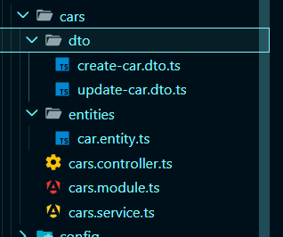

Modulo `tuitions`:
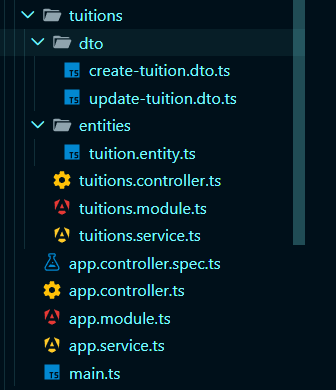

Tambien se construyeron los DTOs con validaciones para controlar los datos de entrada de cada recurso. En estas capturas se observan las reglas aplicadas para los campos de `cars` y `tuitions`.

DTO de `cars`:
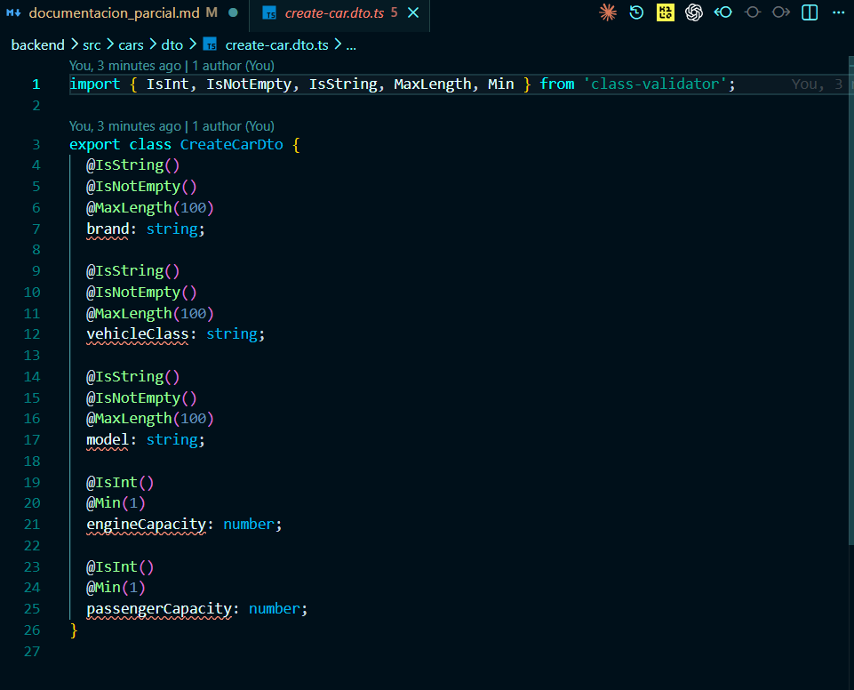

DTO de `tuitions`:
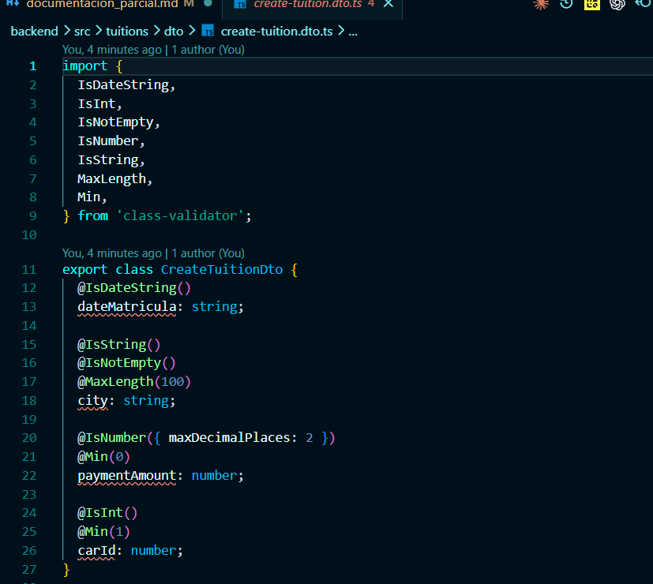

Adicionalmente, se agrego una ruta de siembra con `Faker` para generar `20 registros` en `cars` y `20 registros` en `tuitions`. Para esto se creo un modulo `seed` con su estructura interna, su controlador y su configuracion.

Estructura del modulo `seed`:
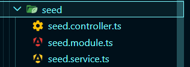

Controlador de `seed`:
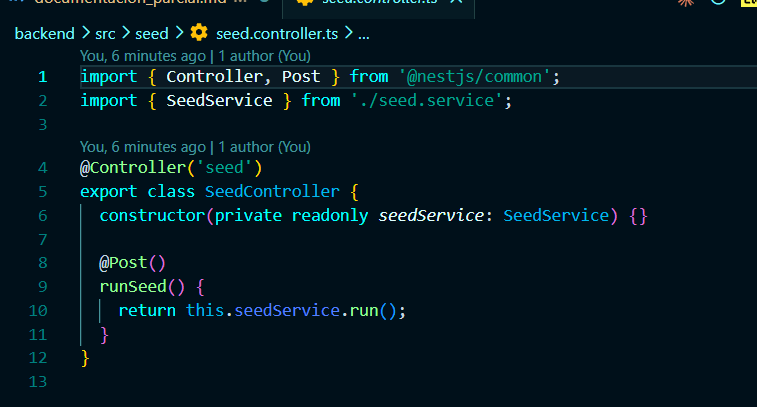

Configuracion del modulo `seed`:
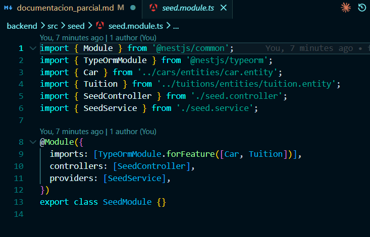

Logica de `seed.service.ts`:
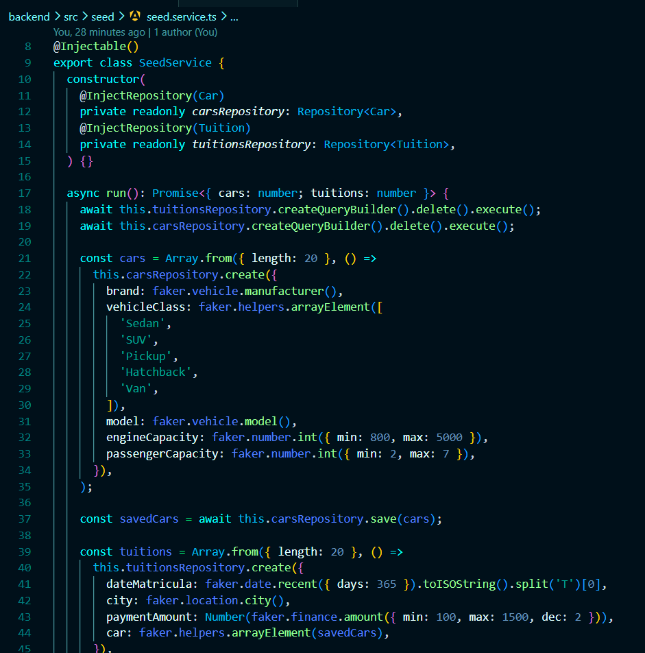

Con esto, el proyecto ya cuenta con modelos, validaciones y la base funcional para el CRUD y la generacion de datos de prueba.

5: En este punto se verifico la creacion fisica de las tablas y la carga de datos en `PostgreSQL` usando DBeaver.

Primero se levantaron los contenedores con la configuracion de `PostgreSQL`.
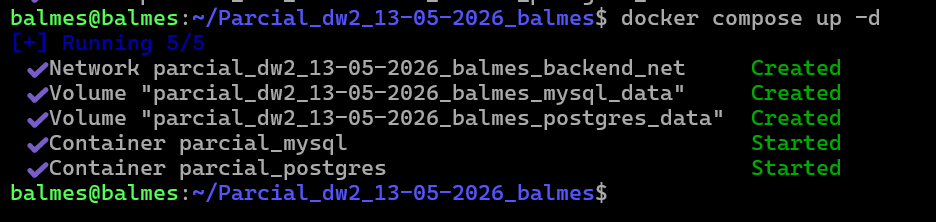

Despues se verifico que el ORM hubiera creado correctamente las tablas `cars` y `tuitions`.
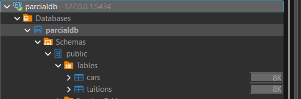

Antes de ejecutar el seed, se pudo observar la tabla `cars` creada pero sin registros cargados.
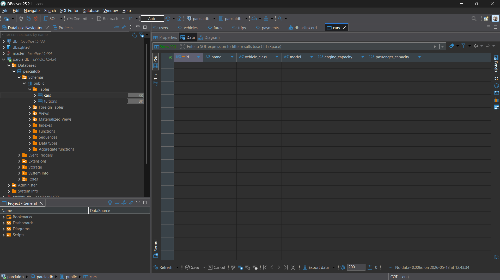

Luego de ejecutar el seed, se cargaron `20 registros` en la tabla `cars`.
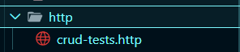

De la misma forma, tambien se cargaron `20 registros` en la tabla `tuitions`.
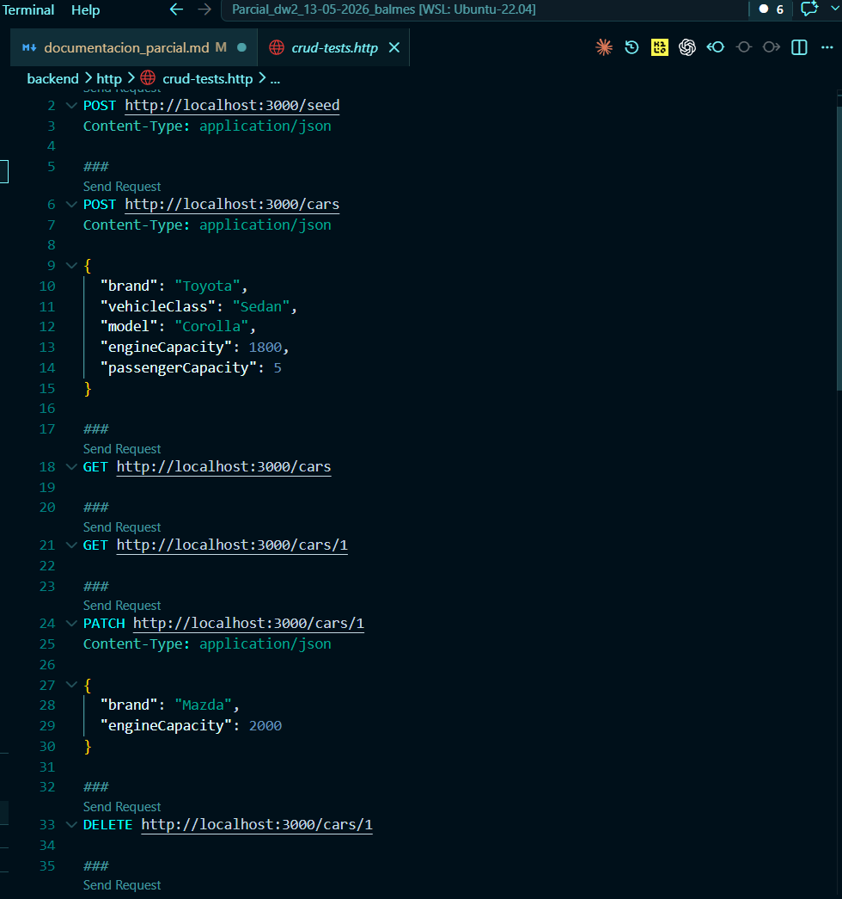

6: Finalmente, se dejo preparado un archivo de pruebas HTTP con las peticiones CRUD necesarias para probar el backend.

Estructura de la carpeta `http`:
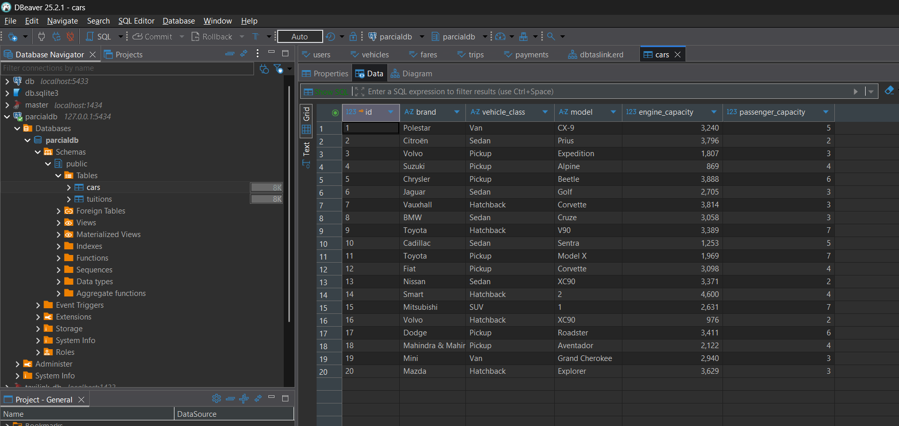

Archivo `crud-tests.http`:
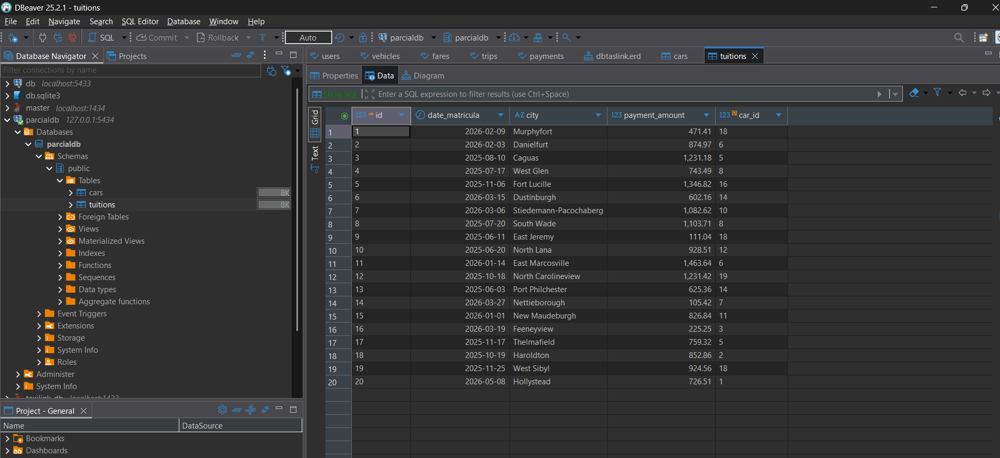

Como evidencia adicional, tambien se muestra una prueba exitosa del endpoint `GET /cars`, donde se observa la respuesta del backend con los datos retornados correctamente.
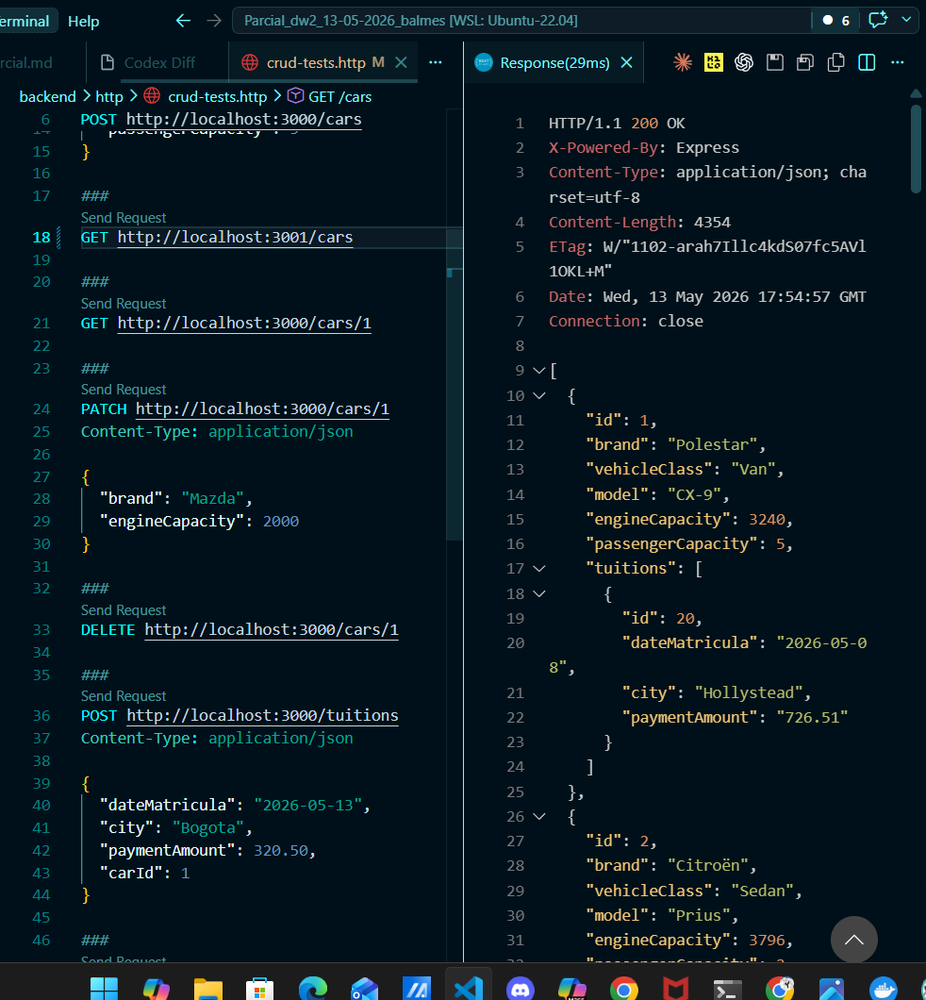
